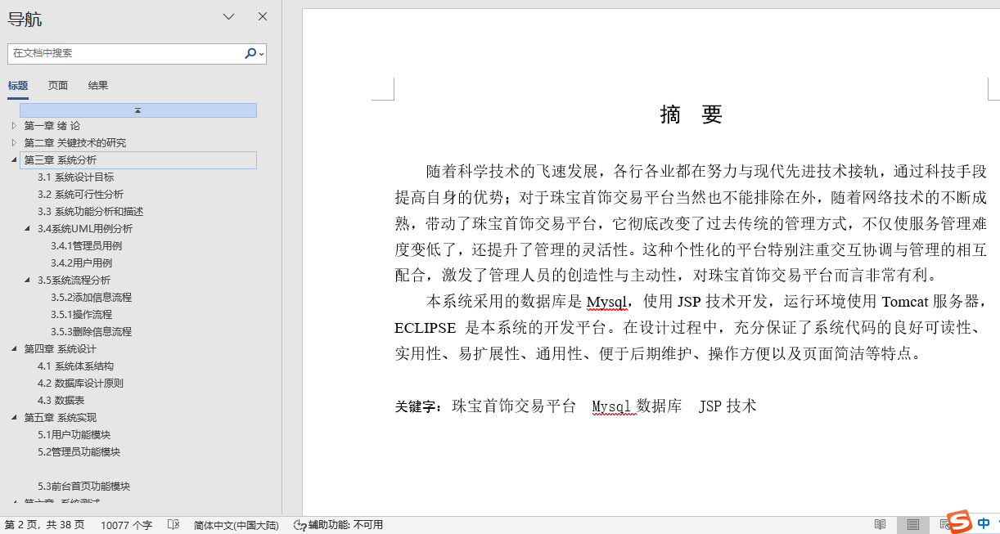

## 基于SSM框架实现的珠宝首饰交易平台(程序+报告)

###  获取sql数据库文件: 从戎源码网 (https://armycodes.com/) QQ: 386869957 QQ群: 377586148
###  所有系统地址: (https://github.com/YuLin-Coder/AllProjectCatalog) 
###  所有项目以及源代码本人均调试运行无问题 可支持远程安装部署调试、定制修改、代码讲解

## 项目介绍
基于SSM框架实现的珠宝首饰交易平台，系统包含两种角色：管理员、用户,系统分为前台和后台两大模块，主要功能如下。

前台：
1. 首页：展示珠宝首饰交易平台的主要推荐商品、促销信息等内容，引导用户浏览和购买商品。
2. 商品信息：展示平台上的珠宝首饰商品，包括商品的图片、价格、描述等信息，并提供商品筛选和排序功能，方便用户查找和选择商品。
3. 新闻资讯：提供珠宝首饰行业的最新资讯和动态，包括新品发布、行业趋势等，帮助用户了解珠宝首饰市场。
4. 购物车：用户可将感兴趣的商品加入购物车，方便统一管理和结算购物车中的商品。
5. 我的：为用户提供个人信息管理、订单查询、收货地址管理等功能，方便用户查看和管理个人资料和订单信息。

后台-用户：
1. 个人中心：提供用户个人信息管理、密码修改、收货地址管理等功能。
2. 我的收藏管理：用户可将喜欢的珠宝首饰收藏起来，方便以后查看和购买。
3. 订单管理：用户可以查看自己的订单信息，包括订单状态、支付情况等，并提供取消订单、确认收货等操作。

后台-管理员：
1. 个人中心：提供管理员个人信息管理、权限管理等功能。
2. 用户管理：管理系统中的用户信息，包括用户的添加、编辑、删除等操作。
3. 商品分类管理：管理珠宝首饰的分类信息，包括分类的添加、编辑、删除等操作。
4. 商品信息管理：管理平台上的珠宝首饰商品，包括商品的添加、编辑、删除等操作。
5. 系统管理：管理系统的基本配置信息，包括网站名称、Logo、版权信息等。
6. 订单管理：管理用户的订单信息，包括订单的查看、处理等操作。

## 项目技术
- 编程语言：Java
- 数据库：MySQL
- 前端技术：JSP、HTML、Jquery、Bootstrap
- 后端技术：Spring、SpringMVC、MyBatis

## 运行环境
- JDK版本：JDK1.8及以上
- 开发工具：IDEA、Ecplise、Myecplise都可以
- 数据库: MySQL5.7及以上

## 运行截图

